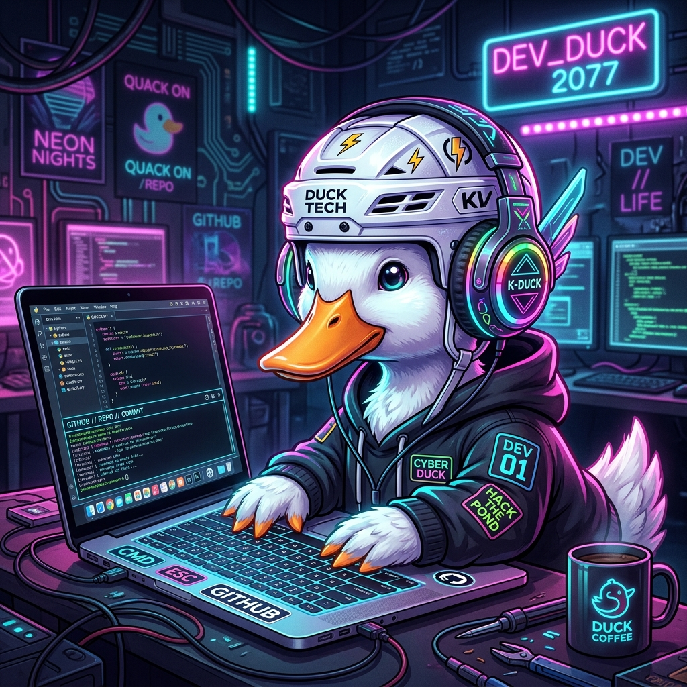

# 👋 ¡Hola! Soy María Zapata 🦆🏒✨

  

  <b>Desarrolladora Fullstack | Entusiasta de Clean Architecture & IA | Fan del K-pop & Hockey</b>

¡Hola! Soy María, una apasionada por construir software estructurado, limpio y estéticamente genial. Disfruto tanto aplicando los principios **SOLID** en mi arquitectura como creando flujos y automatizaciones inteligentes.

Si no estoy escribiendo código (u organizando un tablero de Trello con mis canciones favoritas de K-pop de fondo), seguramente estoy viendo un partido de hockey, explorando nuevos mundos con la Inteligencia Artificial, o pensando en cómo evolucionar a mis mascotas virtuales.

---

## 🚀 Sobre Mí

- 🔭 **Enfoque actual:** Patrones de Arquitectura Limpia, APIs robustas (Python, Laravel, .NET) y desarrollo Frontend súper reactivo.
- 🌱 **Aprendiendo:** ¡Fascinada por la **IA Generativa**! Estoy a punto de arrancar un curso sobre **n8n** para llevar la automatización de procesos y despliegue de IA al siguiente nivel. 🤖
- 📚 **Educación Continua:** Me declaro una eterna aprendiz. Me formo constantemente con recursos como **freeCodeCamp** y **devTalles** para mantener mis habilidades al máximo nivel.
- 👯 **Me gusta colaborar en:** Sistemas donde la organización del código es fundamental, plataformas web escalables, desarrollo de **IoT** y aplicaciones que integren Inteligencia Artificial.
- 🔐 **Intereses técnicos:** Busco seguir profundizando en **Ciberseguridad** y Arquitecturas en la Nube (**Cloud Computing**).
- 📜 **Certificaciones:** Certificada en **SQL**, con amplia experiencia en modelado de datos, consultas avanzadas y optimización de rendimiento.
- 📫 Puedes contactarme a través de mi correo: **[patylo1970maria@gmail.com](mailto:patylo1970maria@gmail.com)**
---

## 💻 Stack Tecnológico

#### **Lenguajes de Programación**

  
  
  
  
  

**🔧 Backend y Arquitectura**

  
  
  
  
  
  
    

**🎨 Frontend y UI**

  
  
  
  
  

**🗄️ Datos, DevOps y Automatización**

  
  
  
  
  
  
  

#### **Otras Herramientas y Tecnologías**

  
  
  
  
  

---

## 🎮 Proyectos Destacados (Echa un vistazo a mi GitHub)

- **🦆 DuckWalk:** Un juego de tipeo en tiempo real construido con Svelte y backend para medir progreso y WPM/Precisión.
- **🐉 DragonGotchi:** MVP enfocado en P.O.O., aplicando a fondo Arquitectura Limpia y principios SOLID *(¡Desarrollado en JavaScript!)*.
- **🎓 Plataforma-Educativa:** Sistema robusto implementado en PHP para la gestión educativa.
- **📚 Sistema de Cursos / MonkeyButCooler:** Aplicaciones con integraciones sólidas, TypeScript, sistemas de autenticación y dashboards personalizados.
- **⚙️ Sistemas Empresariales:** Desarrollo de plataformas gestoras integrando AJAX y vistas con excelente UX (sistemas para vehículos, recetas, etc.).

---

## 📊 Mis Estadísticas Intergalácticas

  
  

  

---

## 🌍 Pongámonos de Acuerdo

  
  

  <em>“El mal código se escribe rápido y se sufre para siempre. ¡Aplica SOLID y automatiza tu vida!”</em> 🏒🎧🤖

